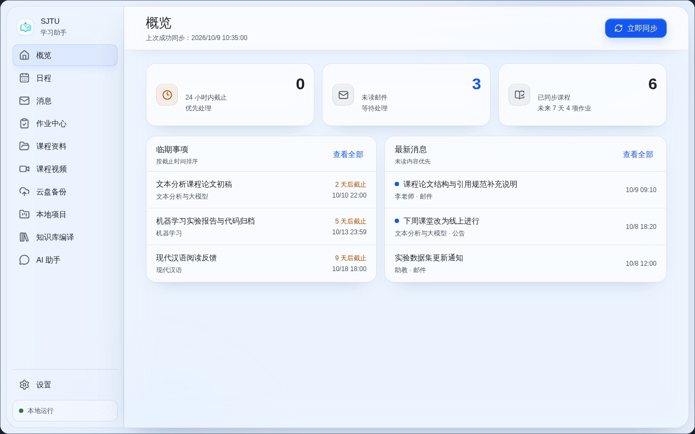
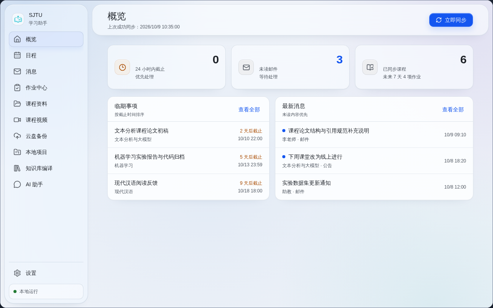
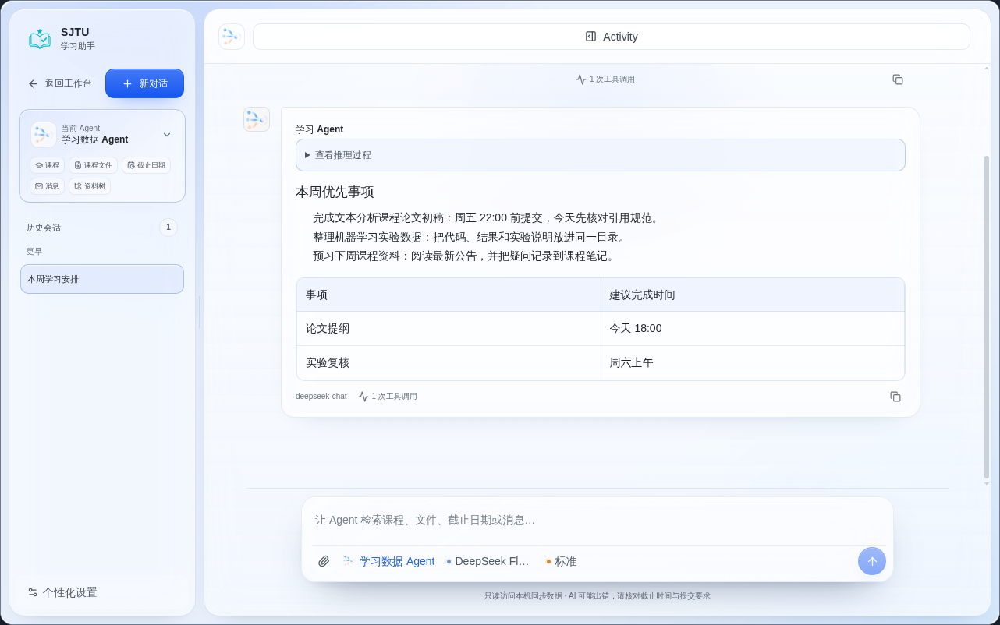
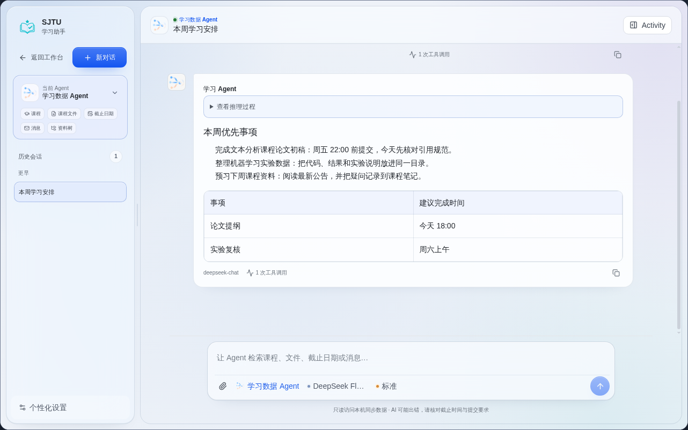
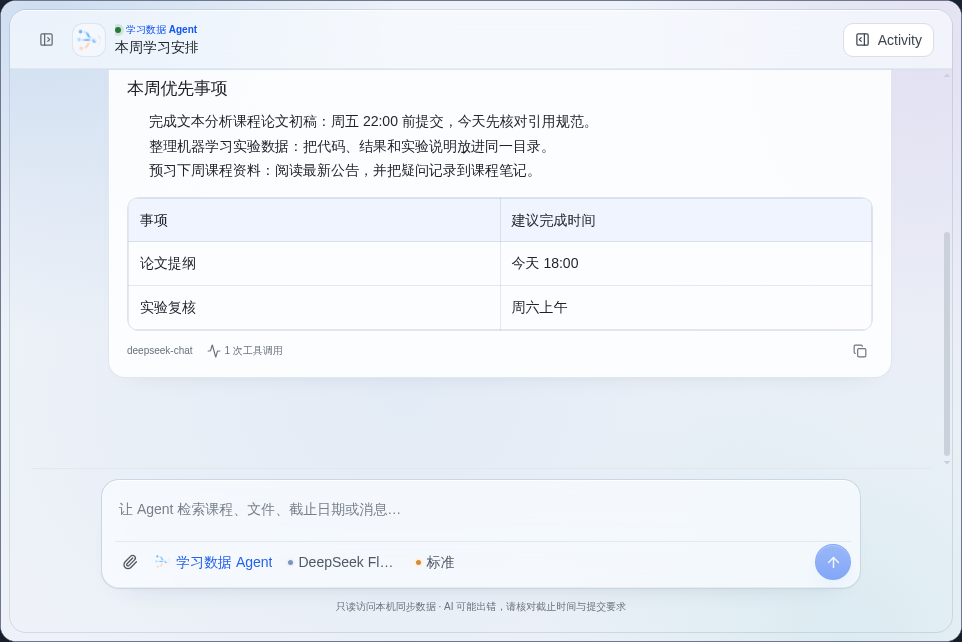
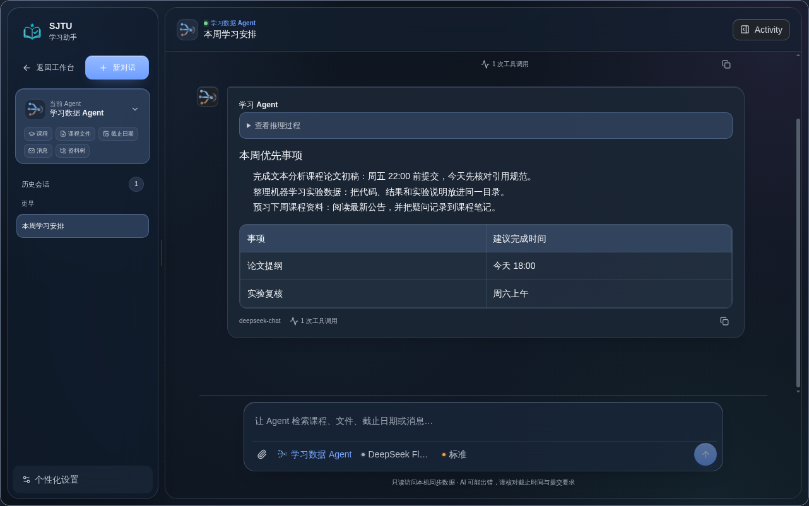

# Aura 毛玻璃 UI 深化验收记录

基线提交：`a7c928b`。真实样式导入顺序为 `index.css → aura-pages.css → ai-chat-aura.css`。本轮只修改真实导入文件；名称含“2/3”的文件提供器副本未改动。

## 材质变量

| 用途 | 浅色填充 | 模糊 | 视觉职责 |
| --- | --- | --- | --- |
| 环境底 | `--aura-canvas: #EEF2F8` | 无 | 蓝、紫、青四块静态径向环境光 |
| 导航/历史 | `--aura-navigation: rgba(241,247,255,.56)` | `28px / 1.14` | 感知后景、保持导航清晰 |
| 顶栏/工具栏 | `--aura-header: rgba(249,252,255,.66)` | `24px / 1.12` | 操作区与背景轻度分离 |
| 数字卡 | `--aura-stat: rgba(249,252,255,.68)` | `20px / 1.10` | 轻量信息层，不暗示点击 |
| 正文/表格 | `--aura-reading: rgba(253,254,255,.91)` | 无 | 长时间稳定阅读 |
| AI 输入框 | `--aura-input: rgba(249,252,255,.72)` | `30px / 1.14` | 单层主要玻璃焦点 |
| 菜单/对话框 | `--aura-overlay: rgba(253,254,255,.94)` | `20px / 1.12` | 覆盖下层内容且保持清楚 |

深色主题使用独立的深蓝灰填充：导航 `.58`、顶栏 `.68`、数字卡 `.70`、阅读面 `.92`、输入框 `.74`、浮层 `.95`，没有复用浅色白色填充。

## 概览前后对比

| 修改前 | 修改后 |
| --- | --- |
|  |  |

修改后背景场景贯穿导航和工作区；三张数字卡共享材质且取消 hover 抬升；“临期事项”和“最新消息”各自只有一个阅读面，列表行使用分隔线而非独立卡片。

## AI 前后对比

| 修改前 | 修改后 |
| --- | --- |
|  |  |

修改后恢复“Agent 与会话标题在左、Activity 在右”；Activity 使用专用 `.ai-activity-toggle`，宽度为内容宽度。用户消息的 body 与内部段落均为透明，仅 `.ai-markdown` 保留单一浅蓝表面。AI 页面使用与普通工作台一致的独立环境背景，不再给 conversation/thread/messages 重复铺白色渐变。

最小窗口与深色主题记录：

- 
- 

## 页面覆盖

| 页面 | 覆盖结果 |
| --- | --- |
| 概览 | 数字卡、阅读面、空状态、列表分隔统一 |
| AI 助手 | 历史导航、会话顶栏、消息、表格、输入框、Activity、菜单统一 |
| 日程 | 工具栏玻璃；月历、议程使用稳定阅读面；日期格无模糊 |
| 消息 | 连续阅读表面；未读、选中、悬停状态分离 |
| 作业中心 | 筛选区轻透；详情和提交区保持阅读材质 |
| 课程资料 | 目录树适度通透；文件列表和预览区使用阅读材质 |
| 课程视频 | 播放器保持深色；列表、工具区和切换工具栏按层级处理 |
| 云盘备份 | 统计、结果、进度和表格减少灰白嵌套 |
| 本地项目/知识库 | 大型介绍面减轻阴影；内部卡片改为间距和分隔线 |
| 设置/权限表格 | 分组、输入、状态反馈和表格复用统一材质 |
| 弹窗/菜单/通知 | 统一使用 overlay 材质并保留 WebKit 前缀与无模糊回退 |

## 实际验证

- 云端 Chromium 以固定 iframe 视口渲染：`1440×900`、`1280×800`、`1024×768`、应用最小窗口 `960×640`。
- 概览在四个尺寸下根文档 `scrollWidth === clientWidth`；AI 在 `1024×768` 和 `960×640` 下会话区为全宽，根文档无横向溢出。
- Activity 操作后重新读取：`aria-expanded` 从 `false` 变为 `true`；1280 宽度下 Activity 为 `300px`、conversation 为 `700px`，标题仍可见。
- 用户消息重新读取：message body 为透明、`padding: 0`、无 border/shadow/blur；段落透明；只有 markdown 表面保留浅蓝背景。
- 浅色、深色均完成渲染截图；AI 表格、长回复、滚动区、输入框和最小窗口未发生遮挡。
- 前端全量：35 个测试文件、300 项测试通过。
- Biome：97 个文件通过；TypeScript 与 Vite production build 通过；`git diff --check` 通过。
- Impeccable detector 按要求只运行一次；唯一发现的 `padding-right` 布局动画已删除，未重复运行检测。

## 尚未验证

- 云端 Chromium 不能替代真实 macOS WKWebView；尚未在本轮云端任务中重新安装、签名和启动 `.app`。
- `prefers-reduced-transparency`、`prefers-reduced-motion` 与无 `backdrop-filter` 已有 CSS 回退和专项测试，但尚未通过 macOS 系统辅助功能开关进行人工截图。
- 未使用真实学习数据执行提交、上传或删除；本轮只使用固定测试数据做只读 UI 与交互状态验证。
